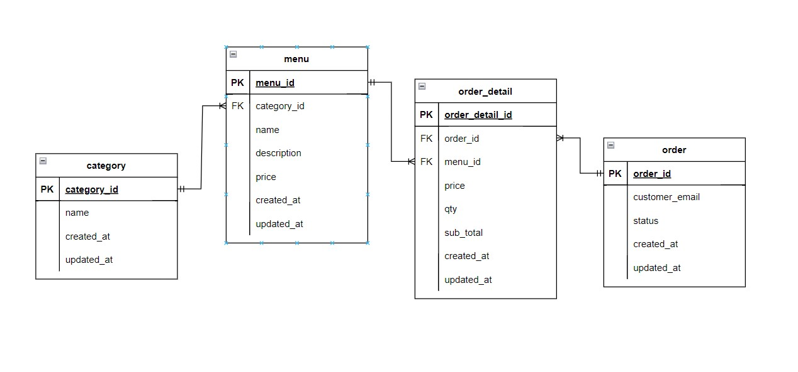

<h1>Final Project</h1>

<h2>Kasus</h2>
1. Membuat menu makanan yang memiliki nama, harga dan deskripsi yang dibatasi dengan 150 kata  
2. Membuat update pada Menu  
3. Membuat list menu  
4. Remove Menu item  
5. Menyimpan data email customer, membuat banyak pesanan dalam 1 order, mengubah data harga  
6. Status awal pesanan dan mengubah status  
7. Report pesanan  

<h2>ERD</h2>

<h2>API Documentation</h2>
Lakukan "bundle install" dahulu    

Untuk Test server "rails server"   
Untuk test spec "rspec -fd"

Introduction Running API 

